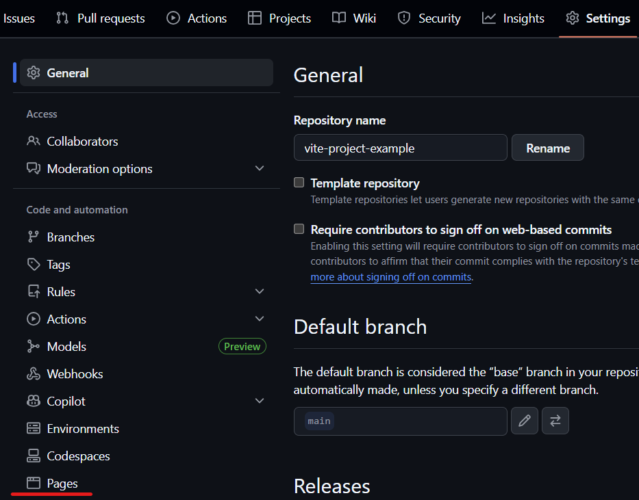
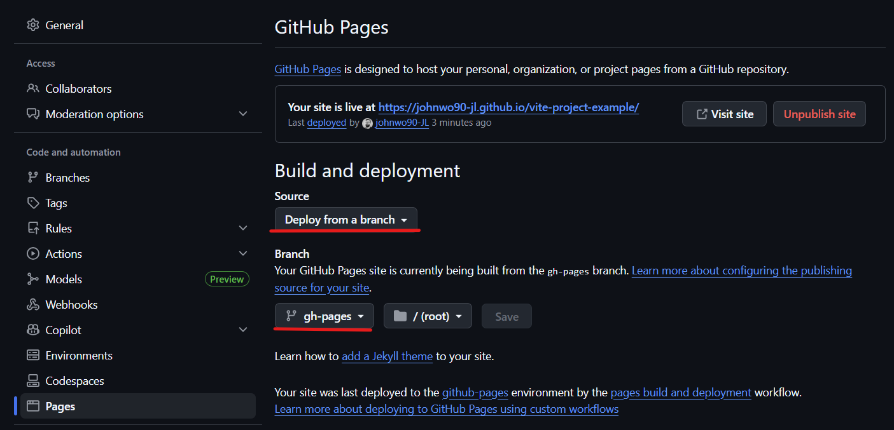

# VITE prosjekt

## Oppsett

- `npm create vite@latest` - Nytt Vite prosjekt.

- `npm create vite@latest my-project -- --template vanilla --no-rollup` - Nytt Vite prosjekt.

## Husk

- Javascfipt (vanilla) som variant/rammeverk
- ikke rollup

## GITHUB PAGES SETUP:

## Lag ekstra fil for å tilpasse for github pages:

vite.config.js - https://vite.dev/config/

import { defineConfig } from 'vite'
import react from '@vitejs/plugin-react'

// https://vitejs.dev/config/
export default defineConfig({
plugins: [react()],
base: "/book-landing-page/"
});

og kjør: npm install gh-pages --save-dev

---

## Legg til predeploy og deploy under script i package.json:

"scripts": {
"predeploy": "npm run build",
"deploy": "gh-pages -d dist",

---

## npm run deploy i terminalen etter prosjektet ligger på github.

---

## I github, gå til settings, pages, code and automation i github pages.

